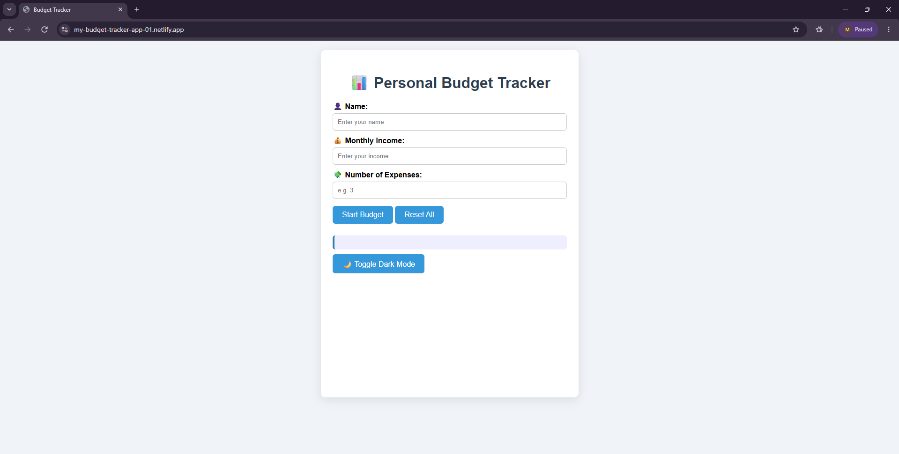

# 💰 Personal Budget Tracker

A responsive and interactive **Personal Budget Tracker Web Application** built with **HTML, CSS, and JavaScript**. This application helps users manage their monthly income, track expenses, calculate savings, analyze financial status, and visualize budget distribution using charts.

## 🔗 Live Demo

[Click here to view the live website](https://my-budget-tracker-app-01.netlify.app)

---

## 📸 Application Preview

---

## ✨ Features

### 💵 Budget Management
- Enter user's name and monthly income
- Add multiple expenses dynamically
- Calculate total expenses
- Calculate remaining balance after expenses

### 📊 Financial Analysis
- Automatic tax calculation (10%)
- Net income calculation after tax
- Savings estimation (20% of remaining balance)
- Financial health status evaluation
- Overspending warning system

### 📈 Data Visualization
- Interactive pie chart using Chart.js
- Visual representation of:
  - Income
  - Expenses
  - Savings

### 🌙 User Experience
- Dark mode support
- Theme preference saved using Local Storage
- Reset budget functionality
- Clear stored budget data

---

## 🛠️ Technologies Used

| Technology | Purpose |
|---|---|
| HTML5 | Webpage structure |
| CSS3 | Styling and responsive layout |
| JavaScript (ES6) | Application logic |
| Chart.js | Data visualization |
| Local Storage | Saving user preferences and budget data |

---

